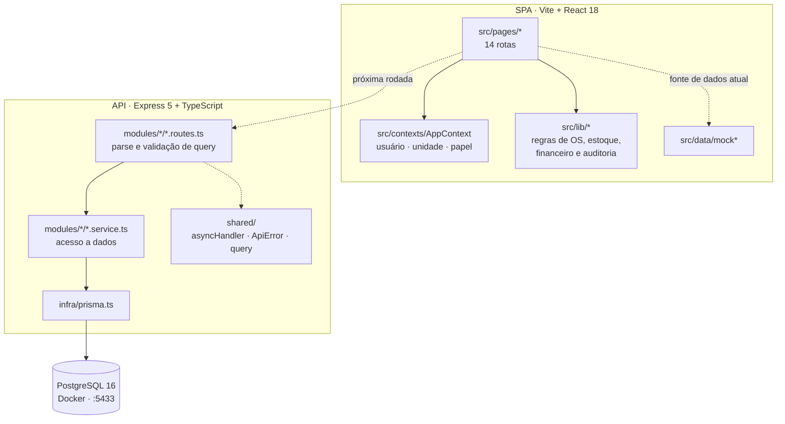
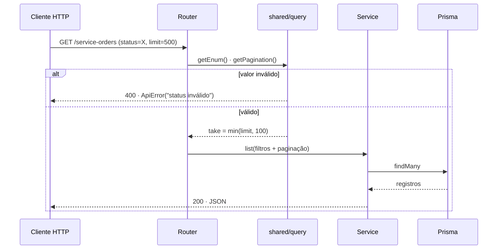
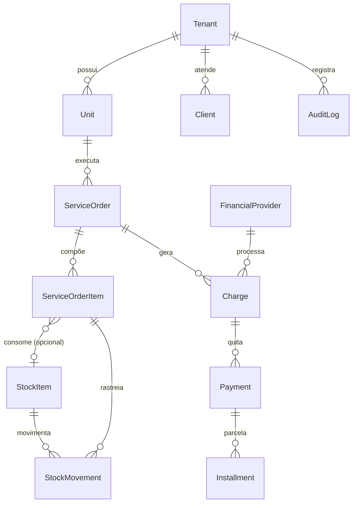

# ViOps


ERP operacional para redes de óticas. Modela o fluxo completo de uma rede com
múltiplas unidades: ordens de serviço (incluindo venda externa executada pela
Central/Fábrica), estoque opcional por rede, cobranças financeiras agnósticas de
provedor e trilha de auditoria por tenant.

O projeto é um monorepo simples com três camadas no mesmo `package.json`: SPA React
(`src/`), API HTTP em Express (`server/`) e fundação de dados em Prisma
(`prisma/`).

## Status

| Camada | Estado |
| --- | --- |
| Frontend (SPA) | Completo em telas e regras de domínio, **consumindo mocks** de `src/data/` |
| API HTTP | Fundação **somente leitura** (`GET`), 7 módulos, sem autenticação |
| Banco / Prisma | Schema, migrations e seed local funcionais |
| Integração front ↔ API | **Não conectada** — migração módulo a módulo é a próxima rodada |
| Autenticação / RBAC | Simulada no `AppContext`; sem JWT ou sessão real |
| Integrações financeiras | Nenhuma. O domínio é genérico por provedor, por decisão de projeto |

## Composição do código

| Linguagem | Arquivos | Linhas | Onde |
| --- | ---: | ---: | --- |
| TypeScript (TSX) | 77 | 10.741 | SPA: páginas, componentes, contexto |
| TypeScript (TS) | 46 | 4.069 | API, regras de domínio, mocks, tipos |
| SQL | 2 | 620 | Migrations Prisma |
| Prisma Schema | 1 | 593 | 22 models, 17 enums |
| Markdown | 5 | 458 | Documentação de decisões |
| CSS / JSON / YAML | 11 | 464 | Tema, configs, Compose |

~87% do código é TypeScript, sob `strict`. Exclui `node_modules/`, lockfile e
artefatos de build.

## Stack

| Camada | Tecnologia |
| --- | --- |
| Build/dev | Vite 5, `@vitejs/plugin-react-swc` |
| UI | React 18, TypeScript 5, Tailwind CSS 3, shadcn/ui sobre Radix UI |
| Roteamento | React Router 6 |
| Estado servidor | TanStack Query 5 |
| Formulários | React Hook Form + Zod |
| Gráficos | Recharts |
| API | Node.js + Express 5, `tsx` em dev, `tsc` para build |
| ORM | Prisma 5 (PostgreSQL 16) |
| Testes | Vitest 3 + Testing Library + jsdom |
| Infra local | Docker Compose |

## Arquitetura

Três camadas independentes no mesmo repositório, deliberadamente desacopladas: a
SPA hoje roda sobre mocks, a API existe e responde, e a ligação entre as duas é a
próxima rodada. Isso permite evoluir domínio e persistência sem travar o produto.



### Fluxo de uma requisição



O `asyncHandler` embrulha cada rota para que rejeições em `async` caiam no
`errorHandler` central em vez de derrubar o processo. Nenhum `try/catch` repetido
nas rotas.

### Modelo de domínio



`ServiceOrderItem → StockItem` é opcional porque estoque é um módulo ligado por
rede (`Tenant.stockEnabled`). `Charge → FinancialProvider` também é opcional: uma
cobrança existe antes de saber por qual provedor será processada.

### Estrutura de diretórios

```text
src/                        # SPA React
├── pages/                  # Uma página por rota (Dashboard, Ordens, Estoque, ...)
├── components/             # Componentes de aplicação
│   └── ui/                 # Primitivos shadcn/ui
├── contexts/AppContext.tsx # Usuário corrente, unidade selecionada, checagem de papel
├── data/                   # Mocks + tipos de domínio (fonte de dados atual)
├── lib/                    # Regras puras: status de OS, estoque, financeiro, auditoria
└── hooks/

server/                     # API HTTP
├── app.ts                  # Composição do Express, CORS, 404 e error handler
├── index.ts                # Bootstrap + shutdown gracioso (SIGINT/SIGTERM)
├── config/env.ts           # Leitura tipada de variáveis de ambiente
├── infra/prisma.ts         # Prisma Client encapsulado
├── modules/<dominio>/      # `*.routes.ts` (HTTP) + `*.service.ts` (acesso a dados)
└── shared/                 # asyncHandler, ApiError/errorHandler, parsers de query

prisma/
├── schema.prisma           # 22 models e 17 enums cobrindo os bounded contexts
├── migrations/
└── seed.ts                 # Seed demo com travas contra execução fora do local
```

### Decisões estruturais

- **Rotas não conhecem Prisma.** `*.routes.ts` valida e normaliza a query
  (`getPagination`, `getEnum`, `getBoolean`) e delega ao service; o Prisma Client
  fica isolado em `server/infra/prisma.ts`.
- **Erros são um contrato.** `ApiError` carrega o status HTTP e o `errorHandler`
  central serializa; fora de produção o detalhe do erro é anexado à resposta.
- **Paginação sempre limitada.** `getPagination` faz clamp em `take` (máx. 100)
  e rejeita `limit`/`offset` inválidos com `400`.
- **Regras de domínio vivem em `src/lib/`**, separadas da renderização — é o
  material que migra para a camada de aplicação do backend quando os endpoints de
  escrita existirem.
- **Estoque é opcional por rede** (`Tenant.stockEnabled`), então
  `ServiceOrderItem.stockItemId` é nulável e o rastro
  `ServiceOrder → ServiceOrderItem → StockItem → StockMovement` só existe quando o
  módulo está ativo.
- **Financeiro é agnóstico de provedor.** `FinancialProvider`, `Charge`, `Payment`
  e `Installment` não referenciam Sicoob, Mercado Pago ou qualquer gateway.

### Regras de negócio consolidadas

- Venda externa pertence à Central/Fábrica, nunca às óticas.
- Óticas não possuem canal externo próprio.
- Estoque consumido por venda externa sai da Central/Fábrica.
- Cobranças são genéricas por tipo e por provedor plugável.

`Unit.type` distingue `CENTRAL_FABRICA` de `OTICA`; a OS externa usa
`saleOrigin = EXTERNA` e `operationalChannel = EXTERNA`, apontando para a Central.

## Pré-requisitos

- Node.js 20+
- Docker (para o PostgreSQL local)

## Setup

```bash
npm install
```

```bash
cp .env.example .env
```

```bash
docker compose up -d
```

```bash
npm run db:generate && npm run db:migrate && npm run db:seed
```

Frontend e API sobem separadamente:

```bash
npm run dev
```

```bash
npm run api:dev
```

- SPA: `http://localhost:8080` (porta padrão do Vite neste projeto)
- API: `http://localhost:3333`

## Variáveis de ambiente

| Variável | Padrão | Uso |
| --- | --- | --- |
| `API_PORT` | `3333` | Porta da API Express |
| `CORS_ORIGIN` | `*` | Origem permitida pelo CORS |
| `DATABASE_URL` | — | Conexão Prisma (PostgreSQL) |
| `POSTGRES_DB` / `POSTGRES_USER` / `POSTGRES_PASSWORD` | `viops` / `viops_dev` / `change_me` | Credenciais do container |
| `POSTGRES_PORT` | `5433` | Porta externa do PostgreSQL |
| `ALLOW_DESTRUCTIVE_SEED` | — | Precisa ser `true` para liberar o seed destrutivo |

O PostgreSQL é exposto em **5433** (interna 5432) de propósito, para não conflitar
com outras instâncias locais.

### Seed destrutivo

`prisma/seed.ts` executa `deleteMany()` antes de recriar os dados demo. Ele só roda
com as três travas satisfeitas:

- `ALLOW_DESTRUCTIVE_SEED=true`
- `NODE_ENV` diferente de `production`
- `DATABASE_URL` apontando para `localhost`, `127.0.0.1` ou `viops-postgres`

## Scripts

| Script | Efeito |
| --- | --- |
| `npm run dev` | Vite dev server |
| `npm run build` | Build de produção da SPA |
| `npm run lint` | ESLint |
| `npm run typecheck` | `tsc --noEmit` |
| `npm test` / `npm run test:watch` | Vitest |
| `npm run validate` | lint + typecheck + build + test |
| `npm run api:dev` | API com `tsx watch` |
| `npm run api:build` / `npm run api:start` | Build e execução da API a partir de `dist-server/` |
| `npm run db:generate` | Gera o Prisma Client |
| `npm run db:migrate` | Cria/aplica migration local |
| `npm run db:seed` | Popula dados demo |
| `npm run db:studio` | Prisma Studio |
| `npm run db:reset` | Reset completo do banco |

`npm run validate` é o portão de qualidade antes de qualquer PR.

## API

Todos os endpoints são `GET` e aceitam `limit` (máx. 100) e `offset`.

| Recurso | Endpoints | Filtros adicionais |
| --- | --- | --- |
| Health | `/health`, `/health/db` | — |
| Units | `/units`, `/units/:id` | `tenantId` |
| Clients | `/clients`, `/clients/:id` | `tenantId`, `search` |
| Service Orders | `/service-orders`, `/service-orders/:id` | `tenantId`, `unitId`, `status`, `saleOrigin`, `operationalChannel` |
| Financial | `/financial/providers`, `/financial/charges` | `tenantId`, `status`, `type`, `providerId` |
| Stock | `/stock/items`, `/stock/movements` | itens: `tenantId`, `unitId`, `category`, `active` · movimentos: `tenantId`, `unitId`, `stockItemId`, `serviceOrderId` |
| Audit | `/audit-logs` | `tenantId`, `entityType`, `entityId` |

```bash
curl "http://localhost:3333/service-orders?saleOrigin=EXTERNA&limit=10"
```

Valores de enum inválidos retornam `400` com a mensagem do campo; recursos
inexistentes retornam `404`.

## Documentação complementar

- [`docs/backend-foundation.md`](docs/backend-foundation.md) — decisões de modelagem do schema Prisma
- [`docs/api-foundation.md`](docs/api-foundation.md) — desenho da API e escopo de cada rodada
- [`docs/estoque-domain-notes.md`](docs/estoque-domain-notes.md) — regras do módulo de estoque
- [`docs/viops-refinement-state.md`](docs/viops-refinement-state.md) — regras consolidadas e limites de escopo

## Roadmap

1. Autenticação e escopo de tenant no backend antes de expor a API ao frontend.
2. Paginação com metadados (`total`, `hasNext`) em vez de array puro.
3. Cobertura de testes para rotas, filtros e regras críticas de estoque —
   hoje a suíte tem apenas um teste de fumaça.
4. Endpoints de escrita por caso de uso, começando pelos cadastros de menor risco.
5. Migração das telas para a API, mantendo os mocks como fallback durante a transição.
6. Code splitting por rota: hoje todas as páginas são importadas estaticamente em
   `src/App.tsx` e o build gera um bundle único acima de 1 MB. `React.lazy` por
   rota é o corte natural.

## Autor

**Gustavo Miguel Nicolodi** — Engenheiro de software, Araucária/PR.

Full-stack em TypeScript, Node.js, Next.js, NestJS, PostgreSQL/Prisma e AWS, com
atuação também em DevOps (Docker, pipelines de deploy, monitoramento). Cofundador
da FCX Solutions. Cursando ADS na PUCPR; graduado em Engenharia Mecânica pela
UNIFACEAR.

Modelagem de domínio, schema Prisma, API e frontend deste projeto são de minha
autoria.

- GitHub: [@BossBurgues](https://github.com/BossBurgues)

## Licença

Código proprietário — todos os direitos reservados.
